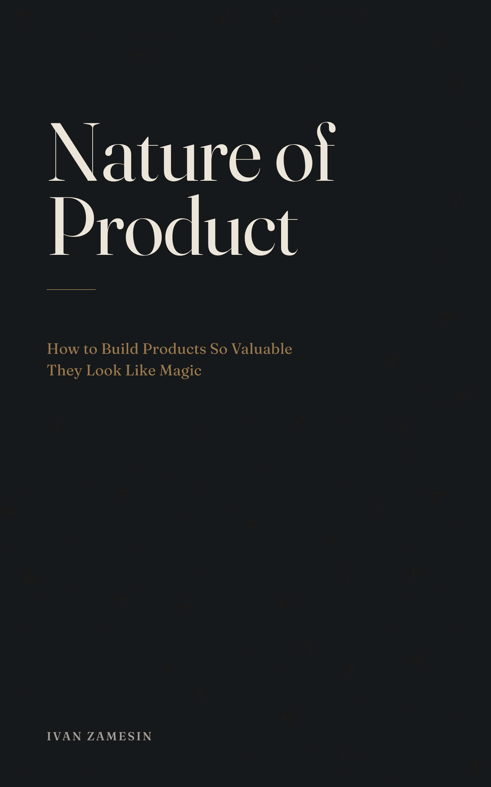

# Nature of Product — Book Cover (contest)



Contest entry — front cover design for Ivan Zamesin's *Nature of Product*. Typography-first, subtle fractal motif, premium nonfiction aesthetic.

---

## Deliverables for submission

| File | Spec |
|---|---|
| [exports/ebook/nature-of-product-ebook.png](exports/ebook/nature-of-product-ebook.png) | 1600×2560 px · RGB · PNG — ebook cover |
| [exports/print/nature-of-product-print.pdf](exports/print/nature-of-product-print.pdf) | 6.25×9.25 in · 300 DPI · CMYK · PDF — print front with bleed |
| [exports/source/nature-of-product-live-text.svg](exports/source/nature-of-product-live-text.svg) | live text · vector — editable master |

## Working artifacts

| File | Note |
|---|---|
| [exports/ebook/thumbnail-120px.png](exports/ebook/thumbnail-120px.png) | legibility QC check |
| [exports/print/nature-of-product-print-preview.png](exports/print/nature-of-product-print-preview.png) | visual proof (150 DPI raster from CMYK PDF) |
| [exports/print/nature-of-product-outlined.svg](exports/print/nature-of-product-outlined.svg) | text → outlines, for print shop if needed |

---

## Design Direction

| | What we take | What we avoid |
|---|---|---|
| **Stripe Press / MIT Press** | editorial calm, typography leads, restrained palette | decorative graphics, loud color |
| **Atomic Habits / Thinking Fast and Slow** | strong shelf presence, clear hierarchy at thumbnail size | generic business symbolism |
| **Brief constraint** | fractal as atmosphere, not illustration | literal graphs, brains, gears, arrows |

Brand character: calm, intelligent, premium — the cover should feel inevitable, not designed.

---

## Key Design Decisions

- **Palette — warm near-black + cream:** deep ink background gives shelf authority; cream type stays readable at all sizes.
- **Motif — node-graph constellation:** fractal branching field in the lower third; discovered on second glance, never competes with the title. References the Job Graph methodology at the heart of the book.
- **Typography — Fraunces (display serif):** high contrast, editorial character; title in two-line setting for monumental rhythm.
- **No halo, no spotlight:** motif is ambient texture, not an illustrated object.

---

## Project Structure

```
nature-of-product-cover/
├── src/
│   ├── covers/          # master SVGs (ebook + print)
│   └── lib/motifs.mjs   # parametric fractal generator
├── exports/
│   ├── ebook/           # RGB PNG deliverable
│   ├── print/           # CMYK PDF + outlined SVG
│   └── source/          # editable live-text SVG
├── explorations/        # versioned iterations (v1→v7)
├── design.md            # locked design system
└── docs/changelog.md    # decision log
```

---

## How to render

```bash
node scripts/render.mjs        # → ebook PNG
bash scripts/export-print.sh   # → CMYK PDF + outlined SVG
```

---

## License

Pipeline **code** is MIT (see [`LICENSE`](LICENSE)). The **cover design artwork** is a
contest submission — all rights reserved by the author. Fonts are under the SIL Open
Font License (see `assets/fonts/`).
